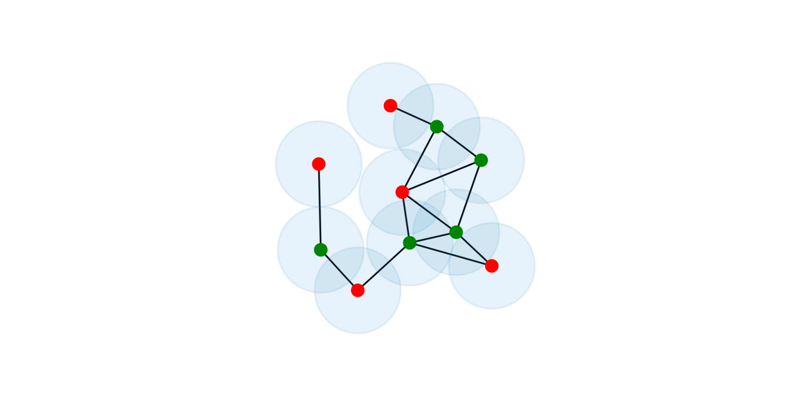

# Combinatorial optimization problems

(image from [arxiv:2006.11190]( https://arxiv.org/pdf/2006.11190.pdf))

Two relevant combinatorial optimization problems are explored

- finding the Maximum Independent Set (MIS) of a graph
- scheduling workers on work lines

We leverage the [or-tools](https://developers.google.com/optimization/) python
library and the [JuMP](https://jump.dev) Julia library.

## MIS

A possible point of view on MIS is to express it as a linear programming
problem. We do so and demonstrate in a Julia notebook how to use the JuMP
library to solve the problem. A python script using or-tools is also available
as a standalone solver.

## Scheduling

Scheduling is a constraint optimization problem, which can be solved by the
CP-SAT solver. `script.py` demonstrate how to do so. For now `planning.py` reads
problem data from standard input and solves it with hard-coded constraints on
length of work and rest time spans.

## Todo

- [ ] Constraints and custom rules from user input
- [ ] Clone `mis` in go using goroutines, compare benchmarks

---

## Note

Linear programming is not the canonical approach to solve the MIS (and it should
less efficient, I presume). Specialized libraries use either an exact algorithm,
or give an approximate solution by sampling in maximal independent sets:

- [igraph](https://igraph.org) (python, C):
  [exact](https://igraph.org/python/doc/api/igraph._igraph.GraphBase.html#maximal_independent_vertex_sets),
  with [this](https://epubs.siam.org/doi/abs/10.1137/0206036) algorithm which
  gets _all_ the maximal independent sets.
- [networkx](https://networkx.org/documentation/stable/index.html) (python):
  approximate, see [this method](https://networkx.org/documentation/stable/reference/algorithms/generated/networkx.algorithms.approximation.clique.maximum_independent_set.html#networkx.algorithms.approximation.clique.maximum_independent_set)
- [mis](https://github.com/Ravenlocke/mis) (Rust): approximate, claims to be
  faster (?) than networkx
- [LightGraphs](https://github.com/JuliaGraphs/LightGraphs.jl) (Julia): exact
